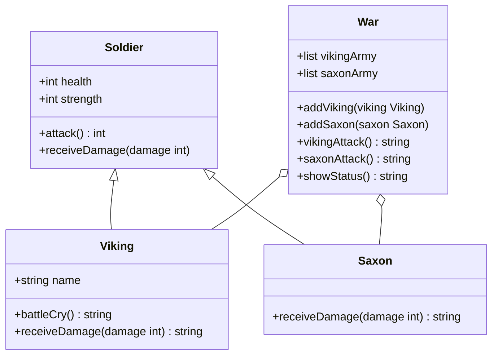

# Vikings Game Class Structure

This document presents the class structure and connections in the Vikings game implementation.

## Class Hierarchy

## Class Descriptions

### Soldier
- **Base class** for all warriors in the game
- Has `health` and `strength` properties
- Implements `attack()` method that returns strength value
- Implements `receiveDamage(damage)` method that reduces health

### Viking
- **Extends Soldier** class
- Adds a `name` property
- Has a unique `battleCry()` method
- Overrides `receiveDamage()` to return a personalized message

### Saxon
- **Extends Soldier** class
- Similar to Viking but with different `receiveDamage()` message
- Represents the enemy army

### War
- Manages the battle between Vikings and Saxons
- Maintains two armies: `vikingArmy` and `saxonArmy`
- Implements game mechanics including attacks and status checking

## Key Relationships

- **Inheritance**: Both Viking and Saxon inherit from Soldier, sharing basic properties and methods
- **Composition**: War class contains multiple instances of both Viking and Saxon classes
- **Polymorphism**: The attack methods work on both Viking and Saxon objects through the Soldier base class

## Game Flow

The War class orchestrates battles by:
1. Having Vikings and Saxons attack each other
2. Removing defeated soldiers from their respective armies
3. Providing status updates on the war's progress
